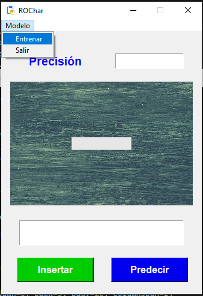
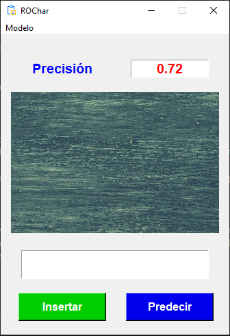
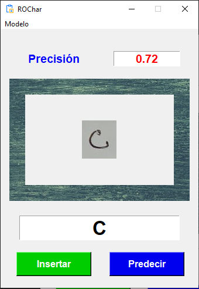

# ROCHAR

## Reconocimiento de caracteres en imágenes - README

Este programa está diseñado para reconocer caracteres en imágenes mediante el uso de redes neuronales artificiales. Utiliza la biblioteca scikit-learn para implementar un clasificador de perceptrón multicapa (MLP), que puede entrenarse con datos de entrada y sus respectivas etiquetas.

## Contenido del Repositorio
* El repositorio contiene los siguientes archivos y carpetas:
    - main.py: Este es el archivo principal que contiene el código fuente del programa.
    - images/: Esta carpeta contiene las imágenes de muestra que se utilizan para entrenar y probar el modelo.
    - README.md: Este archivo, que proporciona información sobre el proyecto.

## Requisitos
* Para ejecutar el programa, asegúrate de tener instaladas las siguientes bibliotecas de Python:
    - numpy
    - opencv-python
    - scikit-learn
    - matplotlib

## Puedes instalar estas dependencias ejecutando el siguiente comando:

```javascript
pip install numpy opencv-python scikit-learn matplotlib
```

## Uso
* Clona o descarga el repositorio en tu máquina local.
* Asegúrate de tener instaladas las dependencias mencionadas anteriormente.
* Ejecuta el archivo main.py con Python.
* El programa entrenará el modelo utilizando las imágenes de muestra proporcionadas en la carpeta images/ y luego realizará predicciones sobre las imágenes de prueba.

## Notas Adicionales
* Puedes modificar los parámetros del clasificador MLP en el archivo main.py para ajustar su rendimiento.
* Asegúrate de tener suficiente poder de procesamiento y memoria disponible para entrenar el modelo, ya que el proceso puede ser intensivo en recursos.

## Informe del proyecto
[Descargar archivo](PROYECTO.pdf)

## Artículo del proyecto
[Descargar archivo](ARTICULO.pdf)

## Imagenes de la aplicación

### Entrenando el modelo
<div>
    
</div>

### Modelo entrenado
<div>
    
</div>

### Modelo prediciendo
<div>
    
</div>

¡Disfruta explorando el proyecto y experimentando con el reconocimiento de caracteres en imágenes!